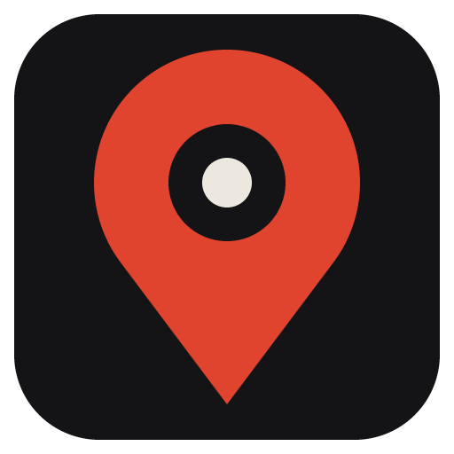

# RustScout

**Rust+ on your desktop, without having your phone out mid-raid.**

RustScout is a free Rust+ companion for Windows. Pair it with a server once and you get the live map, your team,
smart alarms and a bunch of tools in one window, plus a small overlay you can pull up over the game.

## What it does

- **Live map** with your team, vending machines, monuments, ore and resource spots
- **Team tracker** and tracked players, so you know who's online and where
- **Alerts** for explosions, cargo, heli, Chinook, locked crates, smart alarms, teammate deaths and low TC upkeep, in the app and on Discord if you want
- **Server browser** with pop, wipe dates and map previews
- **Map pins and decay timers** so you stop forgetting to fill the TC
- **Raid, crafting, power and gene breeding calculators**
- **In-game HUD** with the clock, pop and your next decay timer
- **Custom crosshair** and **night vision**

## Install

1. Grab **RustScout-Setup.exe** from the [latest release](https://github.com/Infxrnoz/RustScout/releases/latest).
2. Run it. The installer isn't code-signed yet, so Windows may show *"Windows protected your PC"*. Hit **More info → Run anyway**.

## Getting started

1. Open RustScout and click **Link Steam**, then sign in with Steam in the window that pops up.
2. In Rust, go to **ESC → Rust+ → Pair with server**. The server shows up in RustScout on its own.

That's it. Anything you pair from now on gets picked up automatically.

## Hotkeys

| Keys | What it does |
|---|---|
| `Ctrl` `Alt` `M` | Open RustScout over the game (press again to go back) |
| `Ctrl` `Alt` `O` | Toggle the HUD |
| `Ctrl` `Alt` `X` | Toggle the crosshair (you design it in Settings) |
| `Ctrl` `Alt` `G` / `H` | Night vision brighter / off |

If another app already uses one of these, the tray menu shows which keys RustScout picked instead.

## Good to know

- The overlay and night vision only work with Rust in **Borderless** or **Windowed** mode.
- Some community servers don't allow crosshair overlays or gamma changes. Check the server rules first.
- Want it running 24/7 on a box somewhere? See [HOSTING.md](HOSTING.md).
- Building from source or poking at the internals? See [DEVELOPMENT.md](DEVELOPMENT.md).

## License

Free to use, change and share for **non-commercial** use under the [PolyForm Noncommercial License 1.0.0](LICENSE).
You can't sell it or make money from it. For anything else, ask [@Infxrnoz](https://github.com/Infxrnoz).

---

RustScout is a fan-made project and isn't affiliated with or endorsed by Facepunch Studios. Rust and Rust+ belong to them.
